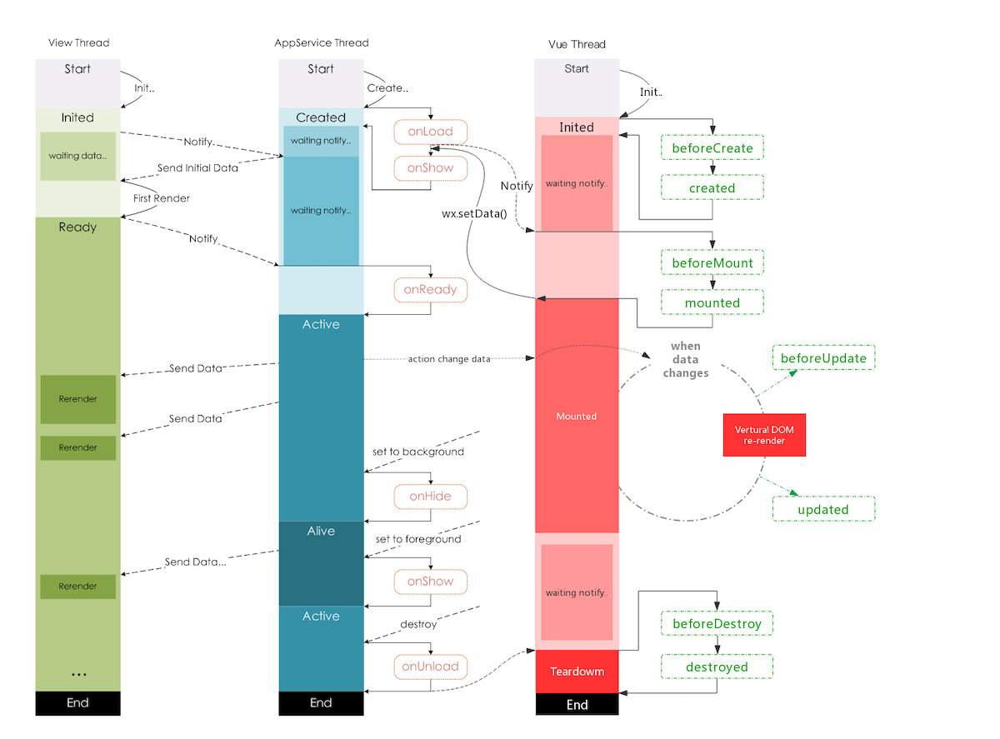

# 小程序特性

## 小程序配置

小程序 App、Page、Component 中的相关配置，需要配置到 Vue 文件 script 部分导出对象的 config 字段中，如：

```javascript
// app.vue
export default {
    // ...
    config: {
        pages: [
            'pages/home/index',
            'pages/example/index'
        ]
    },
    // ...
}

// pages/home/index.vue
// 注意：vue 文件中使用组件按照 vue 规范的 components 字段配置即可，无需在 config 中配置 usingComponents
import Hello from '../../components/Hello/Hello.vue';

export default {
    // ...
    config: {
        navigationBarTitleText: 'Examples'
    },
    components: {
        'c-hello': Hello
    },
    // ...
}

// components/Hello/Hello.vue
// 注意：组件需在 config 中配置 component: true
export default {
    // ...
    config: {
        component: true
    },
    // ...
}

```

## 小程序组件
按照小程序的组件标签名和属性使用，属性绑定使用 vue 语法，如：`<input :value="value" />`

## 小程序事件
按照小程序的事件名使用，事件绑定使用 vue 语法，如 `@tap="onTap"`

## 小程序 API
为了实现多端兼容，框架会在 App 实例及 Page/Component 实例上通过 `$api` 字段来挂载原生 API，即可以在实例上通过 `this.$api` 或者在其他 js 文件中通过 `app.$api` (`app = getApp()`) 来访问小程序 API。

另外，为了开发方便，通过上述方式调用 API 时框架会自动将原生的异步 API 转换为 Promise API，可以直接用 Promise 方式使用，如

```javascript
// 在组件或页面实例中
this.$api.request({
    url: 'https://m.baidu.com/', 
    data: {
        from: 'mars' 
    }
}).then(res => {
    console.log(res.data);
}).catch(err => {
    console.log('错误码：' + err.errCode);
    console.log('错误信息：' + err.errMsg);
});

// 在其他 js 文件中
const app = getApp();
app.$api.request().then();

```


## 扩展 API

### $mpUpdated( [callback, context] )

在 App、Page、Component 新增扩展 `$mpUpdated` API，来注册小程序数据更新视图渲染完成后的回调。

在下次小程序渲染结束之后执行延迟回调，在修改数据之后立即使用这个方法，可以获取数据修改到渲染结束的时间。

- 参数：

    - {Function} [callback]
    - {Object} [context]

- 用法：


```javascript
// 在实例内使用
// 修改数据
this.msg = 'Hello';
// 小程序内容还没有更新
this.$mpUpdated(function () {
    // 小程序视图更新完成
});

// 作为一个 Promise 使用
this.$mpUpdated()
    .then(function () {
        // DOM 更新了
    });

// 在其他位置使用
const app = getApp();
app.$mpUpdated(...);
```

## 获取小程序实例和 Page options
使用框架开发的页面和组件中，`this` 指向的是 Vue 实例，通过下面的方法可以获取到小程序实例。

- 在页面或组件实例中获取对应小程序实例: `this.$mp.scope`
- 在页面实例中获取小程序 Page options: `this.$mp.options`

## 小程序特性支持

自定义组件特性，在 `config` 中直接配置。

- 支持 `externalClasses` （调用组件传入外部样式类属性时暂不支持动态绑定）
- 支持 `options`
- 不支持 behaviors 和自定义扩展


## 小程序生命周期和方法回调

```javascript
// 在 vue 中绑定页面生命周期，注意生命周期和方法中 this 指向 vue 实例
export default {
    // ...
    onLoad(options) {},
    onReady() {},
    onShow() {},
    onHide() {},
    onUnload() {},
    onForceReLaunch() {},
    onPullDownRefresh() {},
    onReachBottom() {},
    onShareAppMessage() {},
    onPageScroll() {},
    onTabItemTap() {},
    // ...
}

// 在 vue 中绑定组件生命周期，注意生命周期和方法中 this 指向 vue 实例
export default {
    // ...
    lifetimes: {
        created() {},
        attached() {},
        ready() {},
        detached() {}
    },
    pageLifetimes: {
        show() {},
        hide() {}
    }
    // ...
}
```
生命周期图示及顺序



如图示，Vue 生命周期与 swan 生命周期触发顺序为：

- [lifetimes Vue:Page] created
- [lifetimes swan:Page] onLoad
- [lifetimes Vue:Page] mounted
- [lifetimes swan:Page] onShow
- [lifetimes swan:Page] onReady

注意：swan 的视图在 Page onReady 时或 Component (lifetimes) ready 时才创建完成，使用视图相关 API 时要注意。
